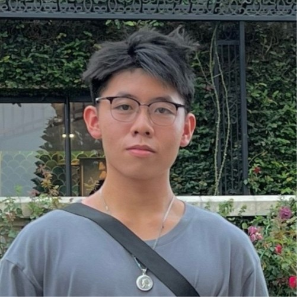

 <h1 align = "center">Hi there!👋</h1>

<!--  -->
<!-- # About Me -->

<!-- 
 -->

<!--  -->

<!-- 

 -->
<!-- 
   
  -->

  
  
  
  
  
  
  

  
  
    

    
    I'm Hung, a <strong>Computer Science and Applied Mathematics</strong> student at the University of Utah. I’m currently working as a Teaching Assistant for the Kahlert School of Computing, helping with the Software Practice I course. Previously, I worked as a Research Assistant for the School of Dentistry and the SCI Institute.
 
    
I like to spend time and learn about many different things. My main interests lie in algorithms (especially graphs), computer graphics, and data science.
 
    
In my free time, I enjoy watching anime, playing musical instruments, and solving coding problems. Some of my coding profiles are linked here if you're interested :D

    
  

# My Projects 👨‍💻

  

    
  

  

    <h2>VSCode Graph Tool
     May 2024
    </h2>
    
Node.js, JavaScript, VSCode API, Azure

    A VS Code extension for visualizing graph data structures. Key features:
    <ul>
      <li>Create nodes and edges using a visual interface.</li>
      <li>Allow basic canvas operations (undo/redo, clear, etc.)</li>
      <li>Export the graph as a DOT file.</li>
    </ul>
    
Links: [<a href="https://github.com/hungphanquocviet/vscode-graph-tool" target="_blank">GitHub</a>]

  

 

  

    
  

  

    <h2>Learning Management System
     Apr 2024
    </h2>
    
MySQL, C#, LINQ, ASP.NET

    A learning management system with key features such as user
authentication, assignment submission, class enrollment, grading, and class management
    <ul>
      <li>Implemented user authentication and role-based access for students, professors, and admins.</li>
      <li>Ensured a stable deployment on a Linux platform, enhancing the overall system performance and reliability.
</li>
    </ul>
    
Links: [<a href="https://github.com/hungphanquocviet/lms">GitHub</a>]

  

  

 

  

    
  

  

    <h2>Multiplayer Snake Game 
     Dec 2023
    </h2>
    
C#, MAUI, TCP/IP, Visual Studio

    A real-time multiplayer snake game, adhering to the MVC architecture.
    <ul>
      <li>Developed a robust networking infrastructure for the multiplayer functionality, utilizing TCP/IP sockets.</li>
      <li>Optimized the game to accomodate a maximum of 20 players at a time without latency issue.</li>
    </ul>
    
Links: [<a href="">GitHub</a>]

  

